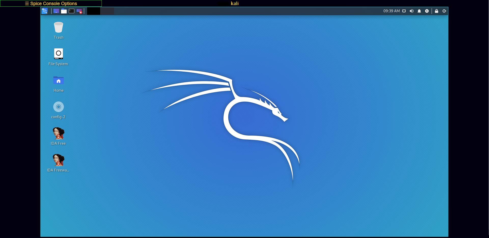
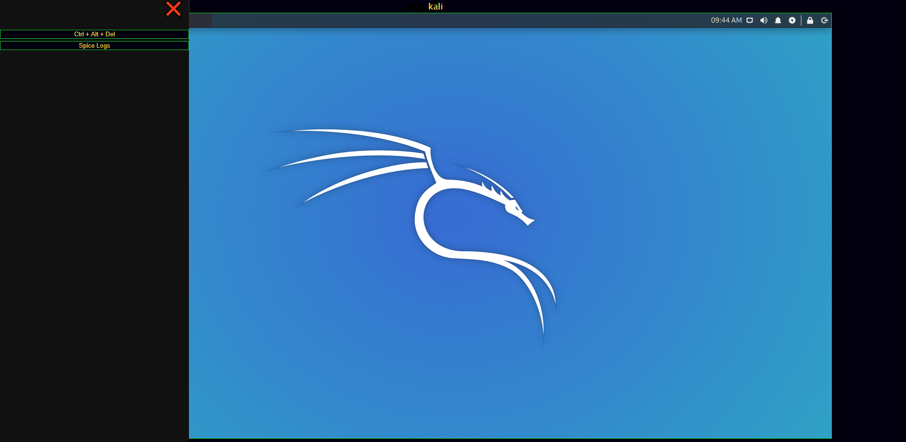
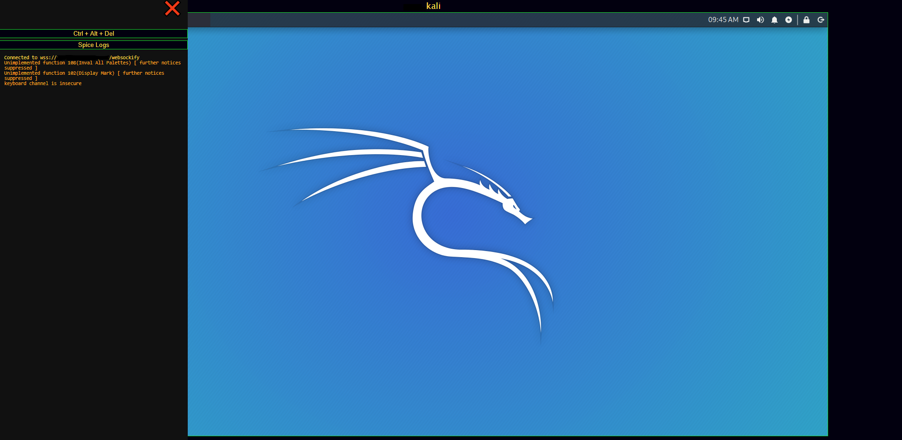

# Openstack (Learning Cloud Engineering)
This is a collection of various Cloud development aides when your are considering the leap into the cloud engineering, Cyber Range Development, and General Integrations.


## Powershell Module to Source an RC file 
* **[Source Code](source.psm1)**  
_Allows for simple sourcing and removal of environmental variables utilizing WIndows Powershell_  

    **Usage:**
    
        Set-Source -Path project-openrc.sh
        Set-Source project-openrc.sh

        Remove-Source


    **General Loops**:  
    
    * Creates ``X`` amount of stacks

    ```powershell
    1..8 | % { openstack stack create --parameter "param1=VALUE;param2=VALUE" -t <YAML File> <STACK NAME>$_; Start-Sleep 20 }
    ```


## Openstack Spice html5 Console 
* **[Source Code](nova/files/)**  
_Consolidates the overall console and eliminates the general clutter of the console to allow for more streamlined viewing_  
  
    **MAIN VIEW**
      
    
    **SIDE MENU**
      
    
    **CONSOLE LOGS**
    
